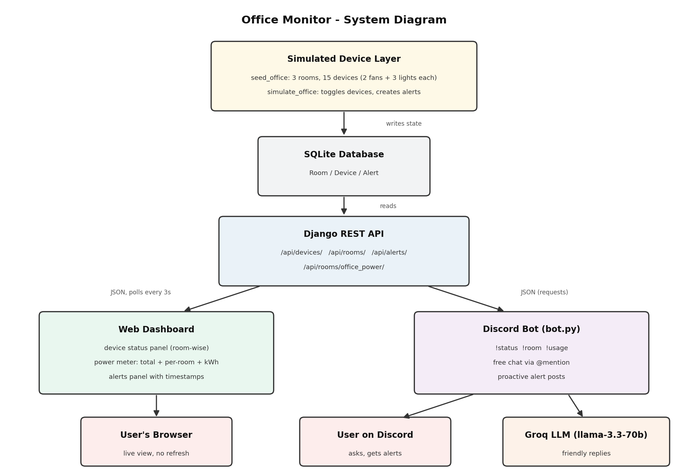

# 🏢 Office Monitor — Lights, Fans, Discord: The Boss's Big Idea

**Techathon 2026 · Preliminary Round · Team The Tech Titans**

A real-time office electricity monitoring system with a live web dashboard and an AI-powered Discord bot — both reading from **one shared backend** (one source of truth).



---

## 📌 Problem Understanding

A small office runs everything on Discord, but people keep leaving **lights and fans ON** after leaving, and the electricity bill keeps climbing. The boss wants to:

1. See every light and fan in the office on a **live dashboard**
2. Check **how much power** is being burned right now
3. Ask a **Discord bot** about it without opening a browser

The office is fixed: **3 rooms** (Drawing Room, Work Room 1, Work Room 2), each with **2 fans + 3 lights** = **15 devices total**. No real hardware exists — device data is **simulated** but dynamic, so the dashboard always has something live to show.

## 🧠 Solution Approach & Architecture

```
[Simulated Device Layer] → [Django Backend API] → [Web Dashboard] && [Discord Bot]
```

- A **simulator** (Django management command) randomly toggles devices and generates alerts, writing everything to a SQLite database — this replaces real hardware.
- A **Django REST API** is the single source of truth. It exposes device states, room summaries, power totals, and alerts as JSON.
- The **web dashboard** polls the API every 3 seconds via JavaScript `fetch()` — live updates with **no page refresh**.
- The **Discord bot** fetches the *same* API endpoints and uses **Groq LLM** to turn raw data into short, friendly, human replies (the boss hates robotic data dumps).

Because both interfaces read from the same API, the dashboard and the bot always reflect the same reality.

## 🛠 Technologies Used

| Layer | Tech |
|---|---|
| Backend | Python, Django, Django REST Framework |
| Database | SQLite |
| Frontend | HTML, Bootstrap 5, Chart.js, vanilla JavaScript (polling) |
| Bot | discord.py, requests |
| AI | Groq API — `llama-3.3-70b-versatile` |
| Config | python-dotenv (`.env` for secrets) |
| Hardware concept | Wokwi (ESP32) |

## ✨ Features

**Web Dashboard** (`http://127.0.0.1:8000/`)
- Live device status panel — all 15 devices grouped by room, green/grey visual indicators
- Live power consumption meter — total watts + per-room breakdown chart + estimated daily kWh
- Active alerts panel with timestamps (after-hours devices ON, all-devices-on-for-2h)
- Updates every 3 seconds without page refresh

**Discord Bot**

| Command | What it does |
|---|---|
| `!status` | Friendly overview of the whole office |
| `!room <name>` | One room's status — valid names: `drawing`, `work1`, `work2` |
| `!usage` | Current total power + estimated daily kWh + per-room breakdown |

- 🎁 **Bonus — free chat:** mention the bot with any office question and it answers conversationally from live data, e.g.
  - `@OfficeMonitorBot which room is using the most power?`
  - `@OfficeMonitorBot is anyone still in the office?`
  - `@OfficeMonitorBot give me a quick summary before I leave`
- 🎁 **Bonus — proactive alerts:** the bot checks the backend every 30 s and posts a friendly ⚠️ warning to the `#alerts` channel on its own when a new alert triggers (e.g. devices left ON after office hours) — no command needed
- Every reply is generated by Groq LLM from the live simulated data — no hardcoded responses

**Simulation**
- `seed_office` creates the fixed office (3 rooms × 5 devices with realistic wattages: fan 60W, light 15W)
- `simulate_office` runs a live loop that toggles devices randomly, updates timestamps, and creates/resolves alerts

## ⚙️ Setup & Installation

```bash
# 1. Clone
git clone https://github.com/ayesha-rahman37/Techathon2026--The-Tech-Titans-.git
cd Techathon2026--The-Tech-Titans-

# 2. Virtual environment
python -m venv venv
# Windows:
venv\Scripts\activate
# Linux/Mac:
source venv/bin/activate

# 3. Dependencies
pip install -r requirements.txt

# 4. Database
python manage.py migrate
python manage.py seed_office
```

Create a **`.env`** file in the project root (never committed):

```
GROQ_API_KEY=your_groq_api_key
DISCORD_TOKEN=your_discord_bot_token
```

> **Note:** for the proactive alert feature, set `ALERT_CHANNEL_ID` in `bot.py` to the ID of the Discord channel where alerts should be posted (right-click the channel → *Copy Channel ID*, with Developer Mode enabled).

## ▶️ How to Run

The full system needs **3 terminals** running on the **same machine** (activate the venv in each):

| Terminal | Command | What it does |
|---|---|---|
| 1 | `python manage.py runserver` | Backend API + dashboard |
| 2 | `python manage.py simulate_office` | Live device simulator |
| 3 | `python bot.py` | Discord bot |

Then open **http://127.0.0.1:8000/** for the dashboard, and type `!status` in the Discord server where the bot is invited.

## 🔌 API Endpoints

| Endpoint | Method | Returns |
|---|---|---|
| `/api/devices/` | GET | All 15 devices — name, type, room, status, wattage, last_changed |
| `/api/rooms/` | GET | Rooms with nested devices + per-room power draw |
| `/api/rooms/office_power/` | GET | Total watts, per-room breakdown, estimated daily kWh |
| `/api/alerts/` | GET | Active alerts with message + timestamp |

## 🤖 AI Integration Details

- **Model:** `llama-3.3-70b-versatile` via **Groq API**
- **Where:** every Discord bot reply — command responses, free-chat answers, and proactive alert posts
- **How:** the bot fetches real JSON from the backend, then sends it to Groq with a system prompt instructing it to act as a friendly office assistant, reply in 2–4 warm sentences, use the given data only, and avoid robotic data dumps
- **Edge cases:** if Groq is unreachable, the bot falls back to sending the raw data so it never fails silently; if the backend is down, the bot replies with a clear "can't reach the office backend" message
- **No hardcoded responses** — every answer is generated from the live simulated data at the moment of asking

## 🔩 Hardware Schematic (Wokwi)

A representative circuit for **one room** (ESP32 + 2 fans + 3 lights) showing how device on/off states would be sensed in real life: each device's switch state is read on an ESP32 GPIO input, and an LED per device mirrors the sensed state. In production the ESP32 would report state changes to the backend over WiFi — in this project that role is played by the simulator.

📷 See `diagrams/wokwi_circuit.png` · 🔗 Live simulation: *(Wokwi project link here)*

## 📁 Project Structure

```
├── bot.py                     # Discord bot (Groq-powered)
├── manage.py
├── office_monitor/            # Django project settings
├── devices/                   # Main app
│   ├── models.py              # Room, Device, DeviceLog, Alert
│   ├── serializers.py         # DRF serializers
│   ├── views.py               # API viewsets + dashboard view
│   ├── urls.py                # API routes
│   ├── management/commands/
│   │   ├── seed_office.py     # Creates 3 rooms + 15 devices
│   │   └── simulate_office.py # Live simulation loop + alert engine
│   └── templates/devices/
│       └── dashboard.html     # Live dashboard (polling)
├── diagrams/                  # System diagram + Wokwi schematic
└── requirements.txt
```